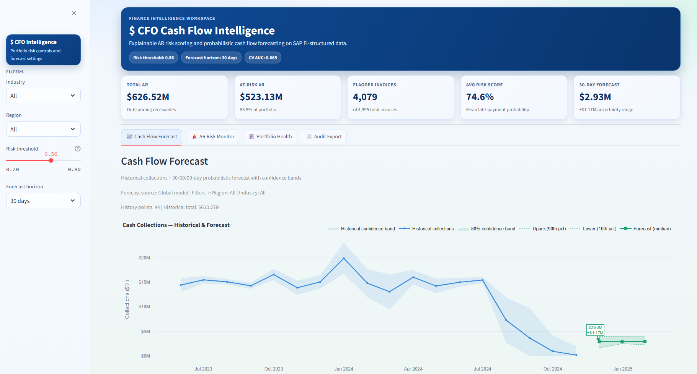
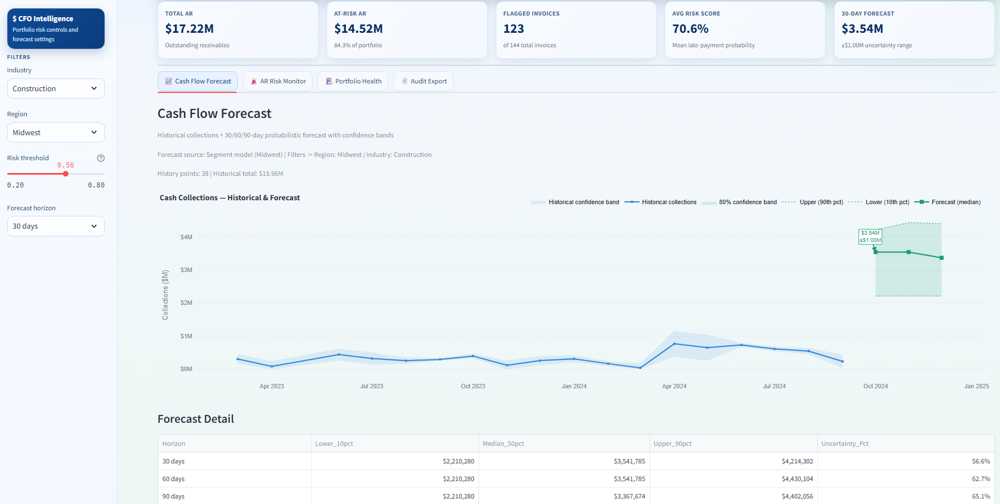

# CFO Cash Flow Intelligence

An end-to-end, explainable ML system for Accounts Receivable that predicts late-payment risk, forecasts 30/60/90-day cash collections, and provides audit-ready narratives from SAP FI-structured data.

## Executive Summary

Finance teams need to answer three operational questions every week:

1. Which invoices are most likely to be paid late?
2. How much cash is likely to be collected in the next 30/60/90 days?
3. Why was a specific invoice flagged, and what action should collections take?

This project solves those questions with:

- `XGBoost` for late-payment probability scoring.
- `LightGBM quantile models` for probabilistic cash forecasting.
- `SHAP` for transparent, per-invoice and portfolio-level explanations.
- `Streamlit dashboard` for decision support and export.

## What We Solve (In Practical Terms)

### The Real Finance Workflow Problem

Most AR teams are not missing data, they are missing timing and prioritization.
They usually know *who* owes money, but not *which invoices* are most likely to slip, *when* that slippage will hit cash, and *why* the model thinks an invoice is risky in a way audit and leadership can trust.

This creates three day-to-day failures:

- Collections effort is spread too thin across low-impact accounts.
- Treasury plans around a single cash number with no downside range.
- High-risk flags are hard to defend without a transparent explanation.

### What This System Changes

For every invoice, the system outputs:

- `LATE_PROB`: likelihood that the invoice will be paid late.
- `RISK_LABEL`: operational tier (`LOW`, `MEDIUM`, `HIGH`) for queue prioritization.
- SHAP explanation: the main factors driving that risk score.

At portfolio level, it outputs 30/60/90-day collection ranges (lower/median/upper), so finance can plan both expected and downside cash positions instead of relying on a single-point forecast.

### How To Read The Current Results

The latest classifier run on the test split (999 invoices) shows:

- Precision (Late) `0.8318`: when we flag an invoice as likely late, it is usually correct.
- Recall (Late) `0.8169`: we catch most late invoices before they happen.
- F1 (Late) `0.8243`: good balance between not missing late invoices and not over-flagging.
- Brier score `0.1494`: probability scores are reasonably well calibrated for prioritization decisions.

The confusion matrix is more useful than raw scoreboards:

- `638` invoices were correctly identified as late risk (good proactive opportunities).
- `143` late invoices were missed (main residual risk area).
- `129` invoices were over-flagged (review load tradeoff).
- `89` invoices were correctly cleared as low-risk/on-time.

Forecast output is intentionally range-based:

- `30 days`: about `$0.78M` (downside) to `$4.01M` (upside), median around `$3.02M`
- `60 days`: about `$0.94M` to `$3.80M`, median around `$2.61M`
- `90 days`: about `$1.67M` to `$3.99M`, median around `$2.87M`

In practice, this supports a simple operating model: collections teams work the high-probability late queue first, while finance plans liquidity against median plus downside scenarios and can justify actions with auditable SHAP reasons.

## Key Capabilities

- Invoice-level late-payment risk scoring (`LATE_PROB`, `LATE_PRED`, `RISK_LABEL`).
- Cash collection forecasts with uncertainty bands (10th/50th/90th percentile).
- SHAP feature attribution and waterfall analysis for flagged invoices.
- Plain-English audit narratives for top risks.
- CFO dashboard with forecast, AR risk monitor, portfolio health, and PDF/CSV export.

## Dashboard Preview

### Executive / Forecast View

This screenshot indicates a high-risk operating state at threshold `0.56`: `4,079 / 4,995` invoices are flagged, and at-risk exposure is `$523.13M` out of `$626.52M` AR (`83.5%`).  
Interpretation: risk is not isolated to a small tail; it is portfolio-wide, so collections should use segment/customer prioritization rather than only chasing isolated invoices.

### Forecast and Risk Context

This view is filtered to `Industry=Construction` and `Region=Midwest`, and still shows high stress: `123 / 144` invoices flagged, `$14.52M` at-risk of `$17.22M` AR, with average risk `70.6%`.  
The forecast table shows a `30d` median of `$3.54M` with downside near `$2.21M` and upside near `$4.21M` (similar spread across `60d/90d`), so the analysis is that cash planning should be downside-aware, not median-only.

### AR Risk Monitor

The top queue is extremely concentrated at the upper end of risk (`~96.5%-96.9%`), and the selected invoice (`1800000624`) is explained by persistent customer behavior (`~32` average days late and `100%` historical late rate).  
Interpretation: the model is signaling repeat behavioral risk, not random invoice noise; actions should be customer-level (credit terms, escalation cadence, account strategy), not just single-invoice follow-up.

### Portfolio Health

Risk concentration is visible by segment: Industry risk is led by `Logistics (80.2%)`, followed by `Manufacturing (77.5%)`; Region risk is highest in `Northeast (76.6%)` and `Midwest (76.3%)`, with `South (70.1%)` lowest.  
The aging heatmap is concentrated in `Current` and `1-30 days` buckets, while the late-rate trend stays elevated across quarters (roughly mid-70s to low-80s), indicating structurally high late-payment behavior rather than a one-quarter anomaly.

## Architecture

```text
Raw SAP-style data (synthetic, FI-structured)
  -> validation + data quality checks
  -> feature engineering + train/test split
  -> late-risk classifier (XGBoost + calibration + threshold policy)
  -> cash forecaster (LightGBM quantiles with segment fallback)
  -> SHAP explainability + narratives
  -> Streamlit dashboard + PDF/CSV exports
```

## Repository Structure

```text
cashflow-intelligence/
  config/                    # YAML configs (paths, model params, dashboard defaults)
  data/
    raw/                     # Generated SAP-style raw files
    processed/               # feature_store.csv, train.csv, test.csv
    exports/                 # Charts, risk_report.csv, generated PDF outputs
  docs/
    dataset.md               # Raw dataset field descriptions
  imgs/                      # README/dashboard screenshots
  models_saved/              # Trained artifacts (classifier, forecaster, SHAP explainer)
  notebooks/
    01_eda.ipynb
    02_feature_engineering.ipynb
    03_feature_analysis.ipynb
    04_model_experiments.ipynb
    05_shap_analysis.ipynb
  src/
    data/                    # generator.py, validator.py, features.py
    models/                  # classifier.py, forecaster.py, evaluator.py, explainer.py
    dashboard/               # app.py, charts.py, export.py
    utils/                   # config.py, logger.py
  tests/
  Makefile
  requirements.txt
```

## Data and Scope

- Data is **synthetic** but structured to match realistic SAP FI export patterns.
- This repo is built for **decision support**, not autonomous collections execution.
- Field-level raw data documentation: [`docs/dataset.md`](docs/dataset.md)

## Quick Start

### Prerequisites

- Python 3.10+
- Conda (recommended)
- `make` (optional; direct Python commands also supported)

### Option A: Makefile Workflow

```bash
conda create -n cashflow-intelligence python=3.10 -y
conda activate cashflow-intelligence
make setup
make all
make dashboard
```

### Option B: Direct Module Workflow (No Make)

```bash
conda create -n cashflow-intelligence python=3.10 -y
conda activate cashflow-intelligence
pip install -r requirements.txt

python -m src.data.generator
python -m src.data.validator
python -m src.data.features
python -m src.models.classifier
python -m src.models.forecaster
python -m src.models.evaluator
python -m src.models.explainer

streamlit run src/dashboard/app.py
```

## Makefile Targets

The Makefile is conda-aware by default (`CONDA_ENV=cashflow-intelligence`).

- `make setup` - install dependencies and create working folders
- `make data` - generate data, validate, build feature store
- `make train` - train classifier + forecaster + evaluator
- `make explain` - generate SHAP assets and narratives
- `make dashboard` - launch Streamlit app
- `make test` - run all tests
- `make clean` - remove generated artifacts
- `make all` - `setup -> data -> train -> explain`

Advanced flags:

```bash
# Fail data target if validator returns non-zero
make VALIDATOR_STRICT=1 data

# Run with a different conda env
make CONDA_ENV=my-env train
```

## Configuration

All runtime settings are YAML-driven through `src/utils/config.py`.

- `config/paths.yaml` - data/model/export paths
- `config/data_generation.yaml` - synthetic data generation controls
- `config/classifier.yaml` - classifier features, calibration, hyperparameters
- `config/forecaster.yaml` - horizons, quantiles, fallback/training controls
- `config/dashboard.yaml` - dashboard labels/defaults

Optional override:

```bash
set CFI_CONFIG_DIR=C:\path\to\custom\config
```

## Outputs and Artifacts

- `data/processed/`
  - `feature_store.csv`, `train.csv`, `test.csv`
- `models_saved/`
  - `classifier_xgb.json`
  - `classifier_meta.pkl`
  - `classifier_calibrator.pkl`
  - `forecaster_lgbm.pkl`
  - `shap_explainer.pkl`
- `data/exports/`
  - classifier evaluation charts
  - forecast and SHAP charts
  - `risk_report.csv`
  - generated audit PDFs

## Testing

```bash
pytest tests -v
```

Primary coverage:

- classifier behavior and artifacts
- feature engineering pipeline
- forecaster shape/invariants
- SHAP narrative/report generation

## Governance and Risk Notes

- SHAP explanations are provided for transparency, not as a substitute for finance judgment.
- Forecasts are probabilistic; planning should consider downside bands, not only median values.
- Production deployment should include drift monitoring, threshold governance, and model review cadence.

## License

This project is licensed under the MIT License. See the [LICENSE](LICENSE) file for details.

